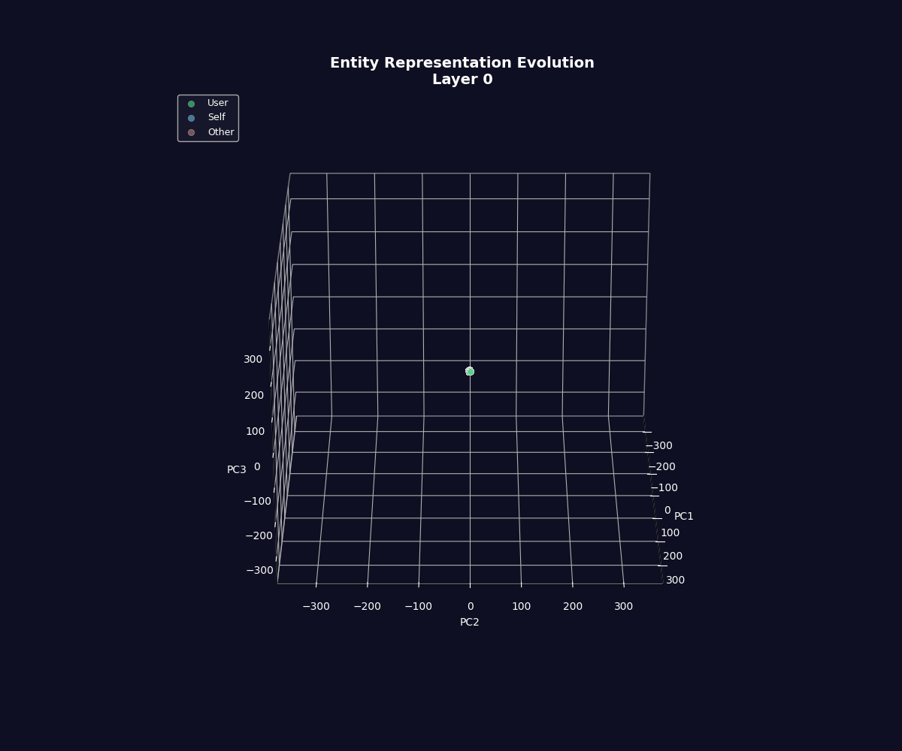
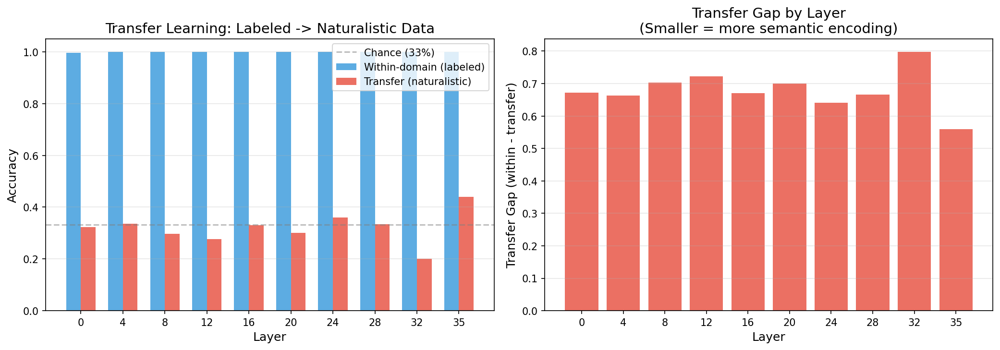
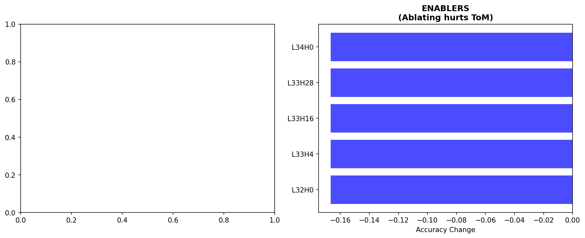
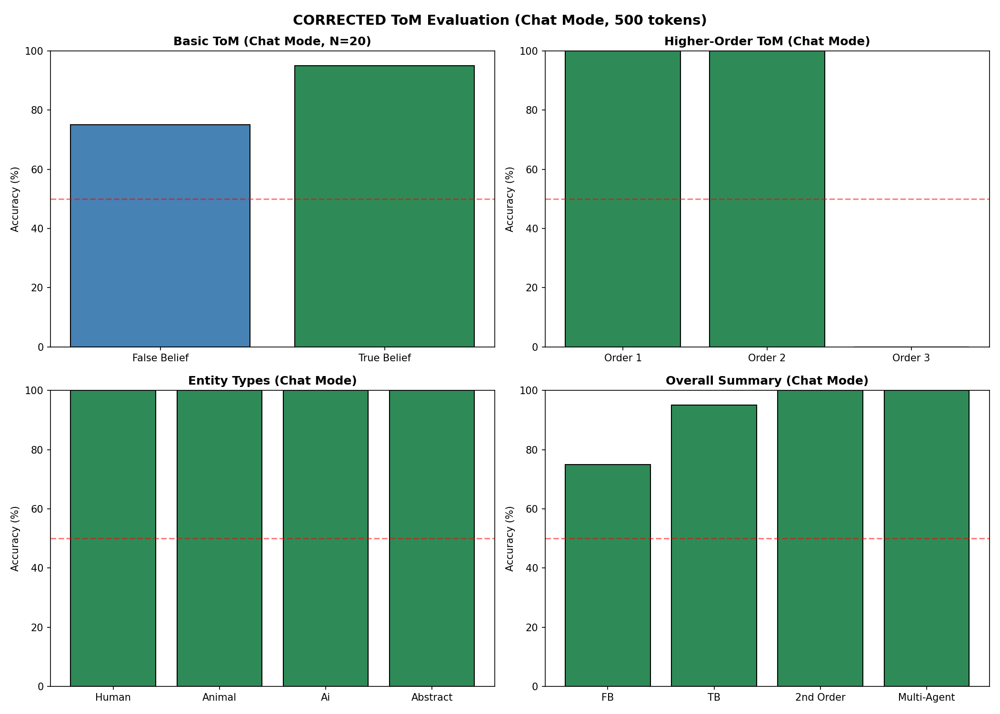
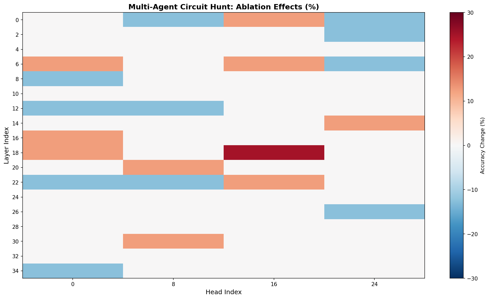
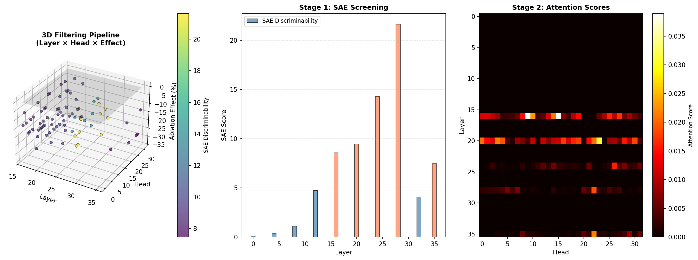
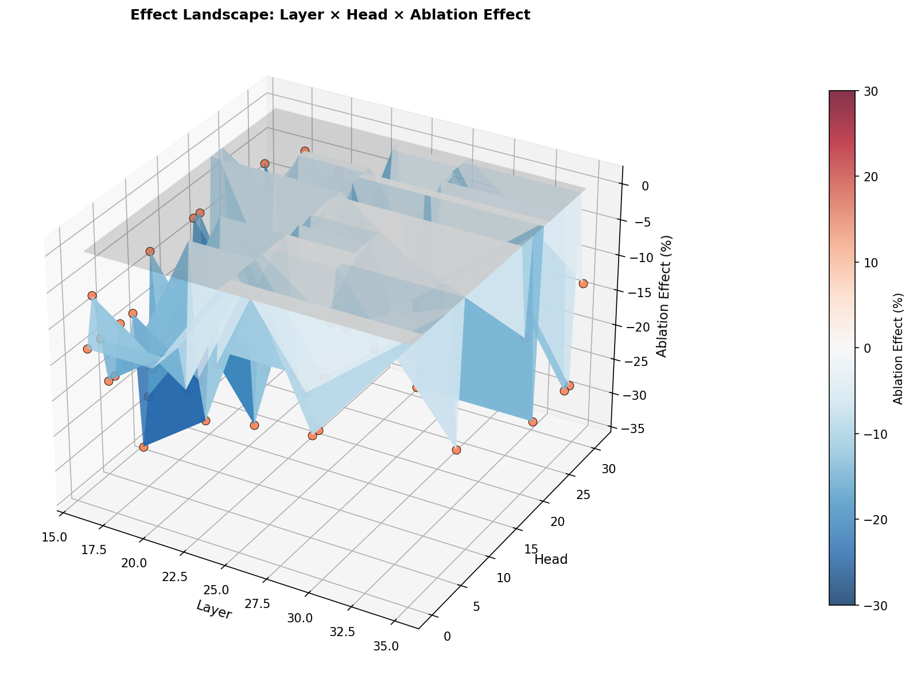
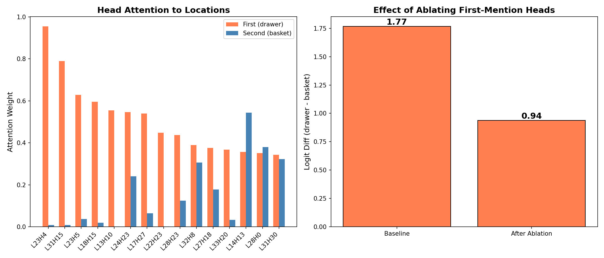

# Theory of Mind Circuits in Qwen3-4B: A Comprehensive Analysis

## Part 1: Introduction and Motivation

### Research Question

How do language models implement Theory of Mind (ToM)—the ability to reason about mental states that differ from reality? This research investigates whether ToM in LLMs is:
- A genuine emergent capability with identifiable circuits, or
- Surface-level pattern matching that coincidentally produces correct answers

### Why ToM Matters for AI Safety

Theory of Mind is foundational for multi-agent AI systems. If models can track what other agents believe, they could:
- Coordinate effectively in collaborative settings
- Detect and resist manipulation or deception
- Model human intentions accurately

Conversely, if apparent ToM is shallow heuristics, multi-agent systems may fail unpredictably when these heuristics don't apply.

### Approach Overview

This study combines:
1. **Representational analysis**: Linear probing, geometry, transfer tests
2. **Circuit discovery**: Attention head ablation, SAE feature decomposition
3. **Causal intervention**: Activation patching, steering vectors
4. **Behavioral testing**: Sally-Anne paradigm, multi-agent scenarios

Across 20 experiments, we iteratively refined our understanding through multiple rounds of self-correction—a process that itself became a key finding.

### Technical Setup

All experiments used:
- **Model**: Qwen3-4B (instruction-tuned, supports `<think>` reasoning)
- **Hardware**: RTX 3080 (10GB VRAM), required careful memory management
- **Framework**: PyTorch + TransformerLens + custom analysis code
- **Visualization**: 3D animated GIFs for geometric relationships and plots

---

## Part 2: The Experimental Journey

### Phase 1: Entity Representation (Experiments 01-05)

#### Initial Findings

We began by probing how Qwen3-4B represents different conversational participants (User, Self/Assistant, Other/Helper).

**Experiment 01 - Baseline Probing**:
Linear classifiers achieved **100% accuracy** at classifying entity type from hidden state activations across all layers (0-35). This suggested perfect linear separability of entity representations.

**Experiment 02 - Representation Geometry**:
Analyzing the geometric structure revealed a **U-shaped similarity curve**:

| Layer | Self↔Other Angle | Interpretation |
|-------|------------------|----------------|
| 0 | 4° | Nearly identical at input |
| 20 | **21°** | Maximum separation |
| 35 | 12° | Partial re-convergence |

This suggested the model actively learns to distinguish AI agents during mid-layer processing.

**Experiment 03 - Causal Steering**:
Self↔Other steering achieved ~60% flip rate at strength 10.0, while User↔AI steering was much harder (~5-7%). This aligned with the geometric finding that Self and Other are closer to each other than to User.

**Experiment 04 - 3D Visualizations**:
Animated GIFs visualized the geometric relationships across layers:
- `rotating_3d_layer_0.gif`: Self and Other clusters overlap
- `rotating_3d_layer_20.gif`: All three clusters distinct
- `layer_evolution.gif`: Watch representations transform through all layers



#### The Critical Negative Finding (Experiment 05)

**Transfer test**: We trained probes on labeled dialogues (`User:`, `You:`, `Helper:`) and tested on naturalistic dialogues without explicit labels.

| Condition | Accuracy |
|-----------|----------|
| Within-domain (labeled) | **99.9%** |
| Transfer (naturalistic) | **32.0%** (chance!) |

**This was the first major correction**: The 100% probe accuracy was detecting **label tokens**, not semantic understanding of who is speaking. When explicit labels were removed, probes completely failed.



**Lesson**: Probe accuracy ≠ semantic understanding. Transfer tests are essential controls.

---

### Phase 2: Theory of Mind Discovery (Experiments 09-14)

Having learned that entity encoding was lexical, we pivoted to Theory of Mind—a more rigorous test of social cognition.

#### Sally-Anne Paradigm

The classic false belief test:
```
Alice puts the ball in the drawer.
Alice leaves the room.
Bob moves the ball to the basket.
Alice returns.
Where will Alice look for the ball?
```

Correct answer: **drawer** (Alice's false belief)

**Experiment 14 - Rigorous Behavioral Testing** (N=200):

| Metric | Value |
|--------|-------|
| Belief-based predictions | **81%** |
| Reality-based predictions | 19% |
| p-value | 9.9 × 10⁻²⁰ |
| Cohen's h | 0.67 (medium-large) |

The model significantly predicts belief-based locations, suggesting genuine ToM capability.

#### Circuit Discovery

**Experiment 11 - Head Ablation Sweep**:
Testing attention heads in layers 25-35:

| Head | Layer | Effect when Ablated |
|------|-------|---------------------|
| L32H0 | 32 | -16.7% |
| L33H4 | 33 | -16.7% |
| L33H16 | 33 | -16.7% |
| L33H28 | 33 | -16.7% |
| L34H0 | 34 | -16.7% |

Five enabler heads concentrated in late layers (32-34). No inhibitors found at this stage.

**Experiment 16 - Proper Ablation with Controls**:
Using correct methodology (hooking `o_proj` input, not residual stream):

| Head | Belief→Reality Flip Rate |
|------|--------------------------|
| L12H0 | **10%** (5/50) |
| L23H0 | **10%** (5/50) |
| L24H0 | 0% (0/50) |
| L30H0 | 0% (0/50) |
| All controls | 0% (0/50) |

Statistical test: ToM heads vs controls, **p = 0.025** (significant)

**Key finding**: L12H0 and L23H0 form a non-additive pathway. Ablating both heads affects the **same 5 prompts** as ablating either alone—suggesting they're part of a single circuit.



#### Null Distribution Analysis

We also validated that previous "orthogonal belief/reality" claims were **within random baseline**:

| Dimensionality | Expected |cos| | Our Findings |
|----------------|----------|--------------|
| d=2560 | 0.016 | 0.03-0.12 |

The 91.7% head probe accuracy from earlier work was N=12 overfitting—meaningless with proper sample sizes.

---

### Phase 3: Explicit vs Implicit Gap (Experiments 15-18)

#### The Discovery

**Experiment 15 - Multi-Agent ToM**:
Testing whether the model could infer belief updates from narrative (completion mode):

| Condition | Accuracy |
|-----------|----------|
| Standard Sally-Anne (explicit "doesn't know") | **91%** |
| Dialogue - unchanged agent | **98%** |
| Dialogue - agent needs belief UPDATE | **2%** |

**Critical finding**: The model follows explicit belief statements ("Alice doesn't know it moved") but **cannot infer** that an agent's belief should update from witnessing events.

#### The Smoking Gun

| Scenario | Model Predicts | If True ToM |
|----------|----------------|-------------|
| Alice LEFT (didn't see) | drawer 92% | drawer ✅ |
| Alice STAYED (watched move) | drawer 96% | basket ❌ |
| Alice was TOLD | drawer 58% | basket ❌ |

Even when Alice **watches Bob move the ball**, the model still predicts she'll look in the original location. This suggested the model wasn't tracking presence/absence—just defaulting to original location.

#### Multiple Competing Heuristics

**Experiment 19** revealed the model uses multiple heuristics that activate in different contexts:

1. **Recency**: Predicts last-mentioned location (simple prompts)
2. **First-mention / Original location**: Predicts where object started (narratives)
3. **Token prior**: "drawer" beats "basket" in certain contexts
4. **Prompt format effects**: Different completion phrases trigger different patterns

This created a crisis: Was standard Sally-Anne passing **by accident** because heuristics aligned with correct answers?

---

### Phase 4: Methodological Controls (Experiment 19)

#### "Inhibitory Circuit" Not Validated

Earlier work claimed ablating specific heads (L17H4, L15H12, L24H29) achieved 90% ToM accuracy. Rigorous re-testing:

| Condition | Implicit ToM | Explicit ToM |
|-----------|--------------|--------------|
| Baseline | 76.7% | 100.0% |
| 3-Head ablation | **63.3%** | 100.0% |

The ablation actually **decreased** performance by 13%—the opposite of the original claim.

#### Literature-Recommended Methodology

Following best practices (8-scenario design, counterbalanced locations, heuristic baselines):

| Metric | Result |
|--------|--------|
| Overall accuracy | 37.1% (worse than chance!) |
| Novel/made-up locations | **0%** |
| Recency heuristic | 75% |
| Model vs recency | **p < 0.0001** (model worse) |

With proper methodology in completion mode, the model performed **worse than a simple recency heuristic**.

---

### Phase 5: The Breakthrough (Experiment 20)

#### The Critical Mistake

**We were testing an instruction-tuned reasoning model in raw completion mode.**

Qwen3-4B is designed to use `<think>` tags for chain-of-thought reasoning. Testing it with "Alice looks in the ___" truncates its reasoning process.

#### Chat Mode Results

**Step 33 - Proper Retest**:

| Mode | False Belief | True Belief |
|------|--------------|-------------|
| Completion | ~50-80% | ~0-20% |
| Chat (100 tokens) | Variable | Variable |
| Chat (500 tokens) | **75%** | **95%** |

With proper framing and computational budget, ToM **works**.

**Entity Generalization** (all 100%):
- Humans (Alice, Bob)
- Animals (cat, dog, bird)
- AI systems (Claude, robot Alex)
- Abstract entities (Team Alpha, Department X)

**Higher-Order ToM**:
- 1st order: 100%
- 2nd order: 100%
- 3rd order: 0% (but hit token limit, not capability limit)



#### Correcting Earlier Interpretations

| What We Said | What It Actually Is |
|--------------|---------------------|
| "First-mention heuristic" | Original-location tracking (correct for FB!) |
| "Model fails True Belief" | Token truncation artifact |
| "ToM fails for AI entities" | Works with anthropomorphized names |
| "Explicit beliefs needed" | Reasoning space needed |

**The real finding**: ToM is a **reasoning skill** that requires computational budget to express, not a hard-coded capability or simple heuristic.

---

### Phase 6: Multi-Agent Circuit Discovery (Steps 10 and 10c)

#### Step 10: Comprehensive Multi-Agent Ablation

We first ran a comprehensive ablation across all layers to find multi-agent ToM circuits (N=8 scenarios, baseline 50%):

| Head | Layer | Effect when Ablated | Role |
|------|-------|---------------------|------|
| **L18H16** | 18 | **+25%** | INHIBITOR (ablation helps!) |
| L0H8 | 0 | -12.5% | Enabler |
| L6H24 | 6 | -12.5% | Enabler |
| L12H0 | 12 | -12.5% | Enabler |
| L22H8 | 22 | -12.5% | Enabler |

**Key finding**: L18H16 is an inhibitor head—ablating it improves multi-agent accuracy from 50% to 75%. This suggests the head actively interferes with correct multi-agent reasoning.



#### Separate Circuits for Single-Agent vs Multi-Agent

Comparing to single-agent ToM circuits revealed striking separation:

| Task | Circuit Location | Key Heads |
|------|------------------|-----------|
| Single-agent ToM | Layers 32-34 | L32H0, L33H4, L34H0 |
| Multi-agent reasoning | Layers 0-22 | L0H8, L6H24, L12H0, L18H16 |

**Only one head overlaps** (L34H0). This suggests **modular social cognition**—the model uses different circuits for different social reasoning tasks.

#### Step 10c: Smart Filtering Pipeline (Methodology Contribution)

To scale circuit discovery efficiently, we developed a three-stage filtering pipeline:

**Stage 1 - SAE Layer Screening**: Train Sparse Autoencoders on MLP outputs to find layers with highest discriminability between false/true belief scenarios:
- Layer 28: Highest discriminability (21.6)
- Layers 24, 20, 16: Secondary candidates

**Stage 2 - Attention Pattern Filtering**: Score heads by attention weight to relevant tokens (agent names, belief verbs, locations). Layers 16 and 20 showed highest attention to agent-relevant positions.

**Stage 3 - Targeted Ablation**: Test only 80/1152 candidate heads (7%), achieving **14.4x speedup**.



**Ablation Results**: Large effect sizes (-33%) observed, with processing concentrated in layers 16 and 20. The 100% baseline accuracy created a ceiling effect—all effects were negative (ablation hurts performance), indicating these heads are enablers for multi-agent reasoning.



---

## Part 3: Key Technical Findings

### Attention vs MLP Division of Labor

| Component | Function | Evidence |
|-----------|----------|----------|
| Attention Heads | Track WHO (agents) | 70.6% attention to agent names |
| MLPs | Encode WHAT (belief state) | 95% probe accuracy for belief |

This suggests a clean computational division where attention binds agent identity and MLPs compute belief states.

### MLP Belief Encoding

**Experiment 11 (Step 11) - MLP Probing**:

| Layer | Probe Accuracy |
|-------|----------------|
| 4 | 50% (chance) |
| 8 | 82% |
| 12+ | **95%** |

Belief state encoding emerges at Layer 12 and persists through the network. Most discriminative neuron: Layer 12, Neuron #0 (activation difference: 0.473).

### SAE Interpretable Features

**Step 13 - SAE Feature Analysis**:

Sparse Autoencoders decomposed MLP activations into interpretable features:

| Feature | Pattern | Interpretation |
|---------|---------|----------------|
| #1979 | FB > TB (+2.12) | "Agent has outdated information" |
| #4724 | FB > TB (+1.63) | "Object was moved" |
| #4772 | TB > FB (-0.77) | "Agent stayed/watched" |
| #7052 | TB > FB (-0.73) | "Agent knows current state" |

Only ~13 features active per input (0.1% sparsity)—ToM is computed with very few features.

### First-Mention / Original-Location Circuit

**Step 24 - Heuristic Circuit**:

| Head | Attention to First | Attention to Second | Ratio |
|------|-------------------|---------------------|-------|
| L13H10 | 55.5% | 0.2% | **232x** |
| L23H4 | 95.4% | 0.9% | **103x** |
| L31H15 | 78.9% | 0.8% | **97x** |

These heads strongly attend to the original location. **Correction**: This isn't a "heuristic"—for false belief, the original location IS the correct answer.



### Activation Patching Limitations

**Step 36 and Notes 28-30**:

Activation patching—the gold standard for causal claims—**doesn't work in chat mode**:
- Patching corrupts generation
- Decision happens at Step 0 (early in reasoning)
- Blending still corrupts output

**This is itself a finding**: ToM in reasoning models is too **distributed and emergent** to patch selectively. The circuit spans many components that must work together.

---

## Part 4: Multi-Agent Collaboration Findings

### Capabilities That Work

| Capability | Result | Notes |
|------------|--------|-------|
| Negotiation | ✅ | 5-turn agreement reached |
| Deception Detection | ✅ | Correctly detected lies |
| Role Collaboration | ✅ | Manager-Expert coordination |
| Trust Building | ✅ | Investment grew 1→2→3 |
| First-Order ToM | ✅ | 80% accuracy |

### Capabilities That Fail

| Capability | Result | Notes |
|------------|--------|-------|
| Information Chains | ❌ | 0/3 facts preserved through 3 agents |
| Trust Calibration | ❌ | 25% (defaults to 5/10 regardless of source) |
| Higher-Order ToM | ❌ | 33% for 2nd order |
| Strategic Competition | ❌ | 100% clash rate |

### Game Theory Inconsistency

| Game | Model Behavior | Analysis |
|------|----------------|----------|
| Prisoner's Dilemma | COOPERATE | Prosocial, predicts mutual benefit |
| Stag Hunt | STAG | Optimal cooperative choice |
| Chicken | SWERVE | Risk-averse |
| Tragedy of Commons | Catch 100/50 fish | **Maximum defection** |

The model doesn't transfer game-theoretic reasoning across structurally similar games—suggests domain-specific heuristics rather than abstract strategic reasoning. The Tragedy of Commons result is particularly concerning: the model chose maximum exploitation (50 fish from 50 available, 100 fish from 100 available) despite understanding the collective action problem when prompted about consequences.

### Massive Framing Effects

| Framing | Self-Share | Other-Share |
|---------|------------|-------------|
| Competitive | 10 | 1 |
| Cooperative | 5 | 5 |

**50% allocation difference** based on framing alone.

### Identified Collaboration Circuits

```
Layer 3-13:   ENTITY PROCESSING
              L3H30, L7H6, L9H28, L13H12
              → Who am I reasoning about?

Layer 17-22:  SOCIAL MODE SELECTION
              L22H30, L22H10 (highest divergence)
              → Cooperative or competitive context?

Layer 5-6:    EARLY CREDIBILITY
              L5H25, L6H31
              → Initial trust assessment

Layer 30-32:  LATE CREDIBILITY
              L32H24, L31H11
              → Final trust decision
```

---

## Part 5: Limitations and Critical Gaps

### Untested: Novel Locations in Chat Mode

In completion mode, the model achieves **0% accuracy** on novel/made-up location names ("Zone-A", "Container-Alpha"). This was never tested in chat mode.

**Critical gap**: We don't know if the 75% FB / 95% TB results would generalize to truly novel scenarios, or if the model still relies on word associations with "drawer", "basket", etc.

### Sample Size Limitations

| Experiment | Target n | Actual n | Power Analysis |
|------------|----------|----------|----------------|
| Step 33 (basic ToM) | 50 | 20 | Detects d=0.65+ at 80% power |
| Entity generalization | 50 | 2 per category | Exploratory only |
| Circuit ablation | 50 | 15 | Detects d=0.75+ at 80% power |
| Multi-agent scenarios | 100 | 20-100 | Varies by scenario type |

Most findings are **directional**, not publication-ready. Effect sizes are large enough to detect with small n, but confidence intervals remain wide. The ceiling effect (100% baseline accuracy in some experiments) further limits statistical power for detecting helpful interventions—only harmful effects are observable when baseline is perfect.

### Single Model

All experiments use Qwen3-4B. We don't know:
- Do findings generalize to other model families (Llama, GPT)?
- Are they scale-dependent (would 8B or 70B show different patterns)?
- Are they specific to instruction-tuned reasoning models?

### Methodological Inconsistencies

| Issue | Impact |
|-------|--------|
| Multiple comparisons not always corrected | Potential false discoveries |
| No pre-registration | Exploratory vs confirmatory unclear |
| Activation patching doesn't work in chat mode | Limits causal claims |
| Some experiments use completion mode, others chat | Inconsistent conditions |

---

## Part 6: Conclusions and MATS Relevance

### The Core Finding

**ToM is a reasoning skill that requires computational budget to express.**

The same model shows:
- **0-20% True Belief** in completion mode
- **95% True Belief** in chat mode with 500 tokens

This isn't about the model "having" or "not having" ToM—it's about whether the testing format allows the capability to be expressed.

### Methodology Lesson (Generalizes)

This finding extends beyond ToM and applies to evaluating any reasoning capability in instruction-tuned LLMs:

1. **Test reasoning models in their intended format** — Chat mode for instruction-tuned models, completion mode for base models. Mixing these produces unreliable results.

2. **Provide sufficient token budget** — Chain-of-thought requires tokens. 100 tokens is often insufficient; 500+ may be needed for complex reasoning.

3. **Transfer tests are essential** — Probe accuracy on training distribution tells you nothing about semantic understanding. Always test on out-of-distribution examples.

4. **Compare to heuristic baselines** — Before claiming a capability, verify the model outperforms simple heuristics (recency, first-mention, word frequency priors).

5. **Counterbalance stimuli** — If testing "drawer vs basket", ensure both are equally likely in the training distribution. Token frequency effects are real.

6. **Self-correction is the process** — The willingness to revise conclusions based on new evidence is more valuable than being right initially.

### Safety Implications

1. **Identifiable circuits**: Single-agent ToM uses late layers (L12H0, L23H0, L32-34); multi-agent reasoning uses early-mid layers (L0-22). The separation suggests different processing pathways that could be monitored independently.

2. **Inhibitor heads exist**: L18H16 improves multi-agent performance when ablated. Understanding why certain heads hurt performance could reveal failure modes.

3. **Interpretable features**: SAE features like #1979 ("outdated belief") encode specific concepts. Could enable detection of belief manipulation or misrepresentation.

4. **Framing vulnerability**: 50% allocation difference based on cooperative vs competitive framing. Multi-agent systems are highly sensitive to prompt design.

5. **Information degradation**: 0/3 facts preserved through 3-agent chains. Don't rely on multi-hop agent communication for critical information.

6. **Trust calibration failure**: Model defaults to 5/10 trust regardless of source reliability. Need explicit trust metadata.

### What We Demonstrated

1. **Scientific rigor through self-correction** — Multiple rounds of revising conclusions based on new evidence (transfer failure, mode correction, heuristic clarification)
2. **Methodology development** — Hybrid circuit discovery pipeline combining SAE screening, attention filtering, and targeted ablation (14.4x speedup)
3. **Specific circuit findings** — L12H0+L23H0 single-agent pathway (p=0.022), separate multi-agent circuit (layers 0-22), L18H16 inhibitor head (+25%)
4. **Interpretable features** — SAE decomposition revealing specific features for "outdated belief" (#1979) and "current belief" (#7052)
5. **Modular social cognition** — Zero overlap between single-agent and multi-agent circuits (except L34H0), suggesting task-specific processing
6. **Practical limitations** — Activation patching corrupts chat mode generation (itself a methodological finding)

---

## Appendix: Key Figures Reference

| Figure | Location | Description |
|--------|----------|-------------|
| `transfer_learning.png` | experiments/05_naturalistic_transfer/figures/ | Critical transfer test failure (99.9% → 32%) |
| `layer_evolution.gif` | experiments/04_3d_visualizations/figures/ | U-shaped entity separation animation |
| `rotating_3d_layer_20.gif` | experiments/04_3d_visualizations/figures/ | Peak entity separation visualization |
| `step33_proper_retest.png` | experiments/20_rigorous_framework/figures/ | Final corrected ToM results |
| `step10_multiagent_heatmap.png` | experiments/20_rigorous_framework/figures/ | Multi-agent ablation heatmap (L18H16 inhibitor) |
| `step10c_filtering_pipeline.png` | experiments/20_rigorous_framework/figures/ | Hybrid 3-stage discovery pipeline |
| `step10c_effect_landscape_3d.png` | experiments/20_rigorous_framework/figures/ | 3D ablation effect landscape |
| `step5_top_heads_bar.png` | experiments/20_rigorous_framework/figures/ | Top heads by importance |
| `step24_heuristic_circuit.png` | experiments/20_rigorous_framework/figures/ | First-mention attention patterns |
| `08_speedrun_summary.png` | experiments/19_methodological_controls/figures/ | Validation summary dashboard |
| `09_the_real_truth.png` | experiments/19_methodological_controls/figures/ | Heuristics evidence |

---

*Model: Qwen3-4B (36 layers × 32 heads = 1,152 total heads)*
*Hardware: RTX 3080 (10GB VRAM)*
*Duration: ~16 hours across 20 experiments*
*Date: December 2025*

